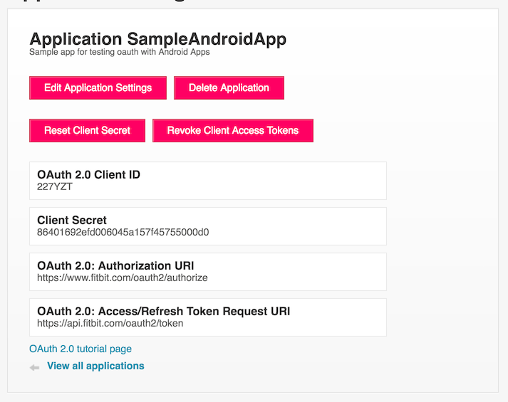
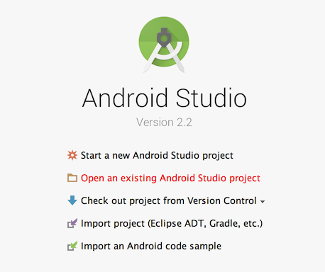
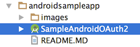

# Fitbit OAuth 2.0 for Android!

This repo contains two Android library modules and a sample Android app for doing OAuth 2.0 with Fitbit APIs:

 - **fitbitauth**: Android library with OAuth 2.0 helper functions (Getting & storing tokens/handling errors/etc.)
 - **fitbitapi**: Android library with helper methods for pulling back data from the Fitbit APIs. This project depends on `fitbitauth`.
 - **app**: Sample Android app using the two aforementioned libraries to connect to the Fitbit APIs and return user and device data
 
  

# Prereqs

### 1. Android Studio

Make sure you have the latest version of Android Studio Installed and the latest Android SDK: https://developer.android.com/studio/index.html If you have never used Android Studio before, it should prompt you to download and install an Android SDK the first time you open the app.

### 2. Register for a Fitbit Dev Account 

Go to https://dev.fitbit.com/apps and create and account. You'll need to use a valid email address and confirm it before continuing.

### 3. Create a Fitbit App

1. Open https://dev.fitbit.com/apps/new
2. Fill out the fields about your app. The first five fields (app name, description, website, organization, and organization website) will be specific to your organization and will be what users see in the app when giving permissions. 
  &nbsp;&nbsp;&nbsp;&nbsp;&nbsp;&nbsp; **Important**:
 &nbsp;&nbsp;&nbsp;&nbsp;&nbsp;&nbsp;&nbsp;&nbsp;&nbsp;&nbsp;&nbsp;&nbsp;For `OAuth 2.0 Application Type` select `Client`
 &nbsp;&nbsp;&nbsp;&nbsp;&nbsp;&nbsp;&nbsp;&nbsp;&nbsp;&nbsp;&nbsp;&nbsp;For `Callback URL` choose a non-url word starting with `https://`. We recommend `https://finished`

 Example: 

 
3. Agree and click Register. You should get a screen with your `Client Id` and `Client Secret`. Copy these and the callback url&mdash;we will need these later.
 

 Example: 

### Generate an Encryption Key (Optional)

In order to store tokens locally on the user's device safely, we base64 encode the token object, and then encrypt using AES. In order to encrypt your token, you'll need to generate a secure encryption key. We have provided a method for generating a secure key in `com.fitbit.authentication.SecureKeyGenerator`. **Note**: This is a Java (Not Android) application, and can by run from Android Studio by right-clicking on the `main` method and clicking on the `Run ... main()` run option. It will print a secure key in console.

  

# Getting Started with the Sample Project

Clone the repo using `git clone <this repo url>`

 

## Open the project using Android Studio

1. Open Android Studio
2. Select `Open an existing Android Studio project` on the splash screen (or go to `File `&rarr;` Open` if the splash screen does not appear)

3. Select the sample Project:

4. Open and wait for Android Studio to index the project

  

## Run!

Click on the "Bug" button to run the app in debug mode (  ). If you do not have a physical device, this will start an emulator and run the app there. If you do have a physical device and would like to use it for testing, follow this guide here: https://developer.android.com/studio/run/device.html

  

## Replace the keys with your own (Optional)

Open `FitbitAuthApplication` and replace the `client id`, `client secret`, `redirect url`, and `secure key` with the ones created during the Prereqs.

    private static final String CLIENT_ID = ...
    private static final String CLIENT_SECRET = ...
    private static final String REDIRECT_URL = ...
    private static final String SECURE_KEY = ...

  

## Select Your Scopes (Optional)

Each scope allows you to access a different set of information about a Fitbit user. Accordingly, a user must give permission for each scope you want to access. Consult https://dev.fitbit.com/docs/oauth2/#scope to figure out what scopes you will need.

In `FitbitAuthApplication`, find the following lines and update to meet your scope needs:

        .addRequiredScopes(Scope.profile, Scope.settings)
        .addOptionalScopes(Scope.activity)

   

# Adding the Libraries to Your Existing Project

## Using the Auth Library

### Configuring the library

The `AuthenticationManager` class does most of the heavy lifting when it comes to Fitbit authentication. It provides helpers for login, logout, storing tokens securely, valid scopes, and more.

First we need to configure the `AuthenticationManager` with our client credentials and callback URL (created during the prereqs). This needs to be done in the Application class in the on `onCreate` method. Start by subclassing the `Application` class and updating the application class in AndroidManifest.xml

FitbitAuthApplication.java:

    public class FitbitAuthApplication extends Application {
    
        @Override
        public void onCreate() {
            super.onCreate();
            
            //TODO configure here
        }
    }

AndroidManifest.xml:

    <application
        android:name=".FitbitAuthApplication"
        ...

To configure the AuthenticationManager, we can use the `AuthenticationConfigurationBuilder` class. This class has options for setting things like token life, login/logout behavior, scopes, and client credentials. We need the client id and secret created above to create a `ClientCredentials` object, and a secureKey to encrypt our token (also created above in the prereqs). Consult https://dev.fitbit.com/docs/oauth2/#scope to figure out what scopes you would need.

    public class FitbitAuthApplication extends Application {
    
        @Override
        public void onCreate() {
            super.onCreate();
   
            ClientCredentials clientCredentials = new ClientCredentials(<CLIENT_ID>, <CLIENT_SECRET>, <REDIRECT_URL>);
            String secureKey = <SECURE_KEY>;
        
            AuthenticationConfiguration config = new AuthenticationConfigurationBuilder()
                                                    .setClientCredentials(clientCredentials)
                                                    .setEncryptionKey(secureKey)
                                                    .addRequiredScopes(Scope.profile, Scope.settings)
                                                    .build();
                                                 
            AuthenticationManager.configure(this, config)                              
                                         
        }
    }
    
**NOTE:** <b>Your `client id`, `client secret`, and `secure key` are sensitive data and thus should be encrypted in an Android keystore and ***NOT*** hardcoded the code. Please consult https://developer.android.com/training/articles/keystore.html for securely storing sensitive data.</b>

 

### Login

From main activity, you can use the login method on `AuthenticationManager`. This will start an activity (using `startActivityForResult`) that will prompt the user to login and give permissions to your app. When the login activity finishes, the `onActivityResult` will be called in the parent activity. Use `AuthenticationManager.onActivityResult` to check to see if the result is from the login activity, and if so, to parse the login response. If the result code does match the login activity result, `AuthenticationManager` will invoke the `onAuthFinished` method of the `AuthenticationHandler` object passed in.

MainActivity.java:

    public class MainActivity extends Activity implements AuthenticationHandler {
    
        ...
    
        public void onLoginClick(View view) {
            AuthenticationManager.login(this);
        }
    
    
        @Override
        public void onActivityResult(int requestCode, int resultCode, Intent data) {
            super.onActivityResult(requestCode, resultCode, data);
            AuthenticationManager.onActivityResult(requestCode, resultCode, data, (AuthenticationHandler) this)
        }
    
    
        public void onAuthFinished(AuthenticationResult authenticationResult) {
            if (authenticationResult.isSuccessful()) {
                //WOOT WOOT!! It worked!
            } else {
                //Uh oh... errors...
            }
        }
        
        ...
        
    }
    
    
 

### Logout

When the user is ready to logout, invoke `AuthenticationManager.logout(context)`:

SomeActivity.class:

    public void onLogoutClick(View view) {
        AuthenticationManager.logout(this);
    }

   

### Checking to see if there is a valid token

Tokens persist, meaning if the user closes your app and reopens it later, a token can still be available and valid (unless it has been revoked by the user, or has expired). When the app starts (or resumes), you can check to see if there is a valid token by doing the following:

Tokens last seven days by default, but this can be extended (using `AuthenticationConfiguration`) to up to one year.

    if (AuthenticationManager.isLoggedIn()) {
        startActivity(...);
    } else {
        AuthenticationManager.login(this);
    }
    
  

## Using the API Library

Once you have authenticated, you probably want to get data! There are three sample API wrappers&mdash;`UserService`, `DeviceService`, and `ActivityService`&mdash;that pull back general user data and data on user devices (respectively). These are just a small sample of the data that can be pulled back from the Fitbit APIs. Feel free to extend these APIs to fit your app's needs.

To use, just call either service with the activity context and data callback:

SomeActivity.java

        try {
            UserService.getLoggedInUser(this, new UserService.UserListener() {
                @Override
                public void onUserLoaded(User user) {
                    //Use user Data!
                }

                @Override
                public void onErrorLoadingUser(String errorMessage) {
                    //Uh oh.. error
                }
            });
        } catch (MissingScopesException e) {
            Toast.makeText(this,
                    String.format(getString(R.string.scopes_missing_format), Joiner.on("`, `").join(e.getScopes())),
                    Toast.LENGTH_SHORT).show();
        }
        
 

### Common API Exceptions

 - **MissingScopesException**: Thrown when a required scope is missing from the token. For instance, to use the `UserService.getLoggedInUserProfile` method your access token needs the `profile` scope. You can find a list of scopes here: https://dev.fitbit.com/docs/oauth2/#scope
 - **TokenExpiredException**: Thrown when the token is no longer valid. If you set `AuthenticationConfiguration.setLogoutOnAuthFailure` to true, this exception will not be thrown, and the app will return to the "before login" activity (An intent to this activity must also be set).